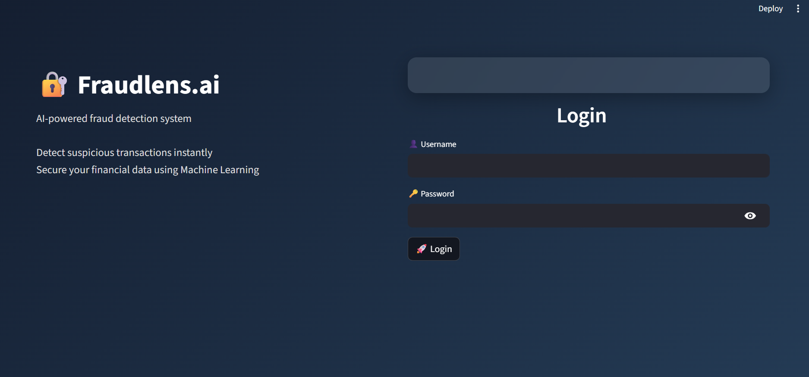
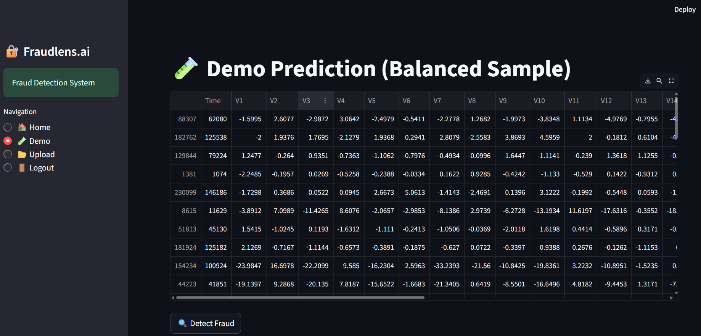
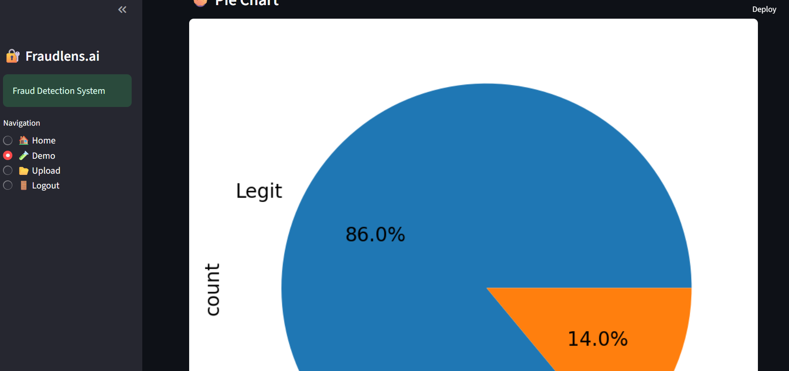
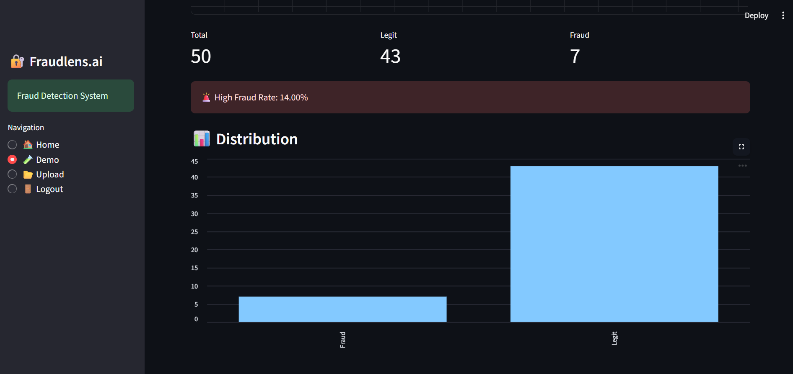

# 🔐 Fraudlens.ai – AI Fraud Detection System

Fraudlens.ai is a machine learning-powered web application that detects fraudulent financial transactions using real-world data. It provides an interactive dashboard with analytics, visualizations, and real-time predictions.

---

## 🚀 Features

* 🔐 Secure Login System
* 🤖 Machine Learning-based Fraud Detection
* 📊 Interactive Dashboard (Metrics, Charts)
* 🧪 Demo Mode with Balanced Data
* 📂 Upload CSV for Custom Predictions
* 📈 Fraud Rate Analysis
* 🥧 Pie Chart & 📊 Bar Graph Visualization

---

## 🧠 Technology Stack

* **Frontend:** Streamlit
* **Backend:** Python
* **Machine Learning:** Scikit-learn (Random Forest)
* **Data Processing:** Pandas
* **Visualization:** Matplotlib

---

## 📂 Project Structure

```id="wqk8r2"
fraud-app/
│── assets/
│   ├── login.png
│   ├── demo.png
│   ├── graph.png
│   ├── bar.png
│── app.py
│── train.py
│── requirements.txt
│── README.md
```

---

## 📊 Dataset

This project uses the **Credit Card Fraud Detection Dataset** from Kaggle.

👉 Download it here:
https://www.kaggle.com/datasets/mlg-ulb/creditcardfraud

⚠️ Note:

* The dataset is **not included in this repository** due to GitHub file size limits.
* Place the file `creditcard.csv` in the project root before running the app.

---

## ⚙️ Installation

```bash id="m8h4k2"
git clone https://github.com/deepakuppala/fraudlens1.git
cd fraudlens1
pip install -r requirements.txt
```

---

## 🧠 Train the Model

```bash id="b8z4dp"
python train.py
```

This will generate:

```id="jv6o3m"
model.pkl
```

---

## ▶️ Run the Application

```bash id="1l6s2z"
streamlit run app.py
```

Open in browser:

```id="b4zq9d"
http://localhost:8501
```

---

## 🔑 Login Credentials

```id="2lt9dk"
Username: admin  
Password: 1234
```

---

## 📸 Screenshots

### 🔐 Login Page



### 🧪 Demo Prediction



### 📊 Dashboard Graph



### 📈 Bar Chart



---

## 🎯 How It Works

1. Load trained ML model
2. Preprocess input data
3. Align dataset features
4. Predict fraud using Random Forest
5. Display results with analytics

---

## ⚠️ Notes

* Fraud data is highly imbalanced (~0.2%)
* Demo mode uses balanced sampling for better visualization
* Uploaded CSV must match dataset structure
* Large files like dataset and model are excluded from the repository

---

## 🚀 Future Improvements

* 🎯 Real-time API integration
* 📊 Confusion Matrix & Advanced Metrics
* 🎨 Enhanced UI/UX
* 🔐 Secure authentication system
* ☁️ Cloud deployment

---

## ⭐ Project Tagline

**Fraudlens.ai – See fraud before it happens**
